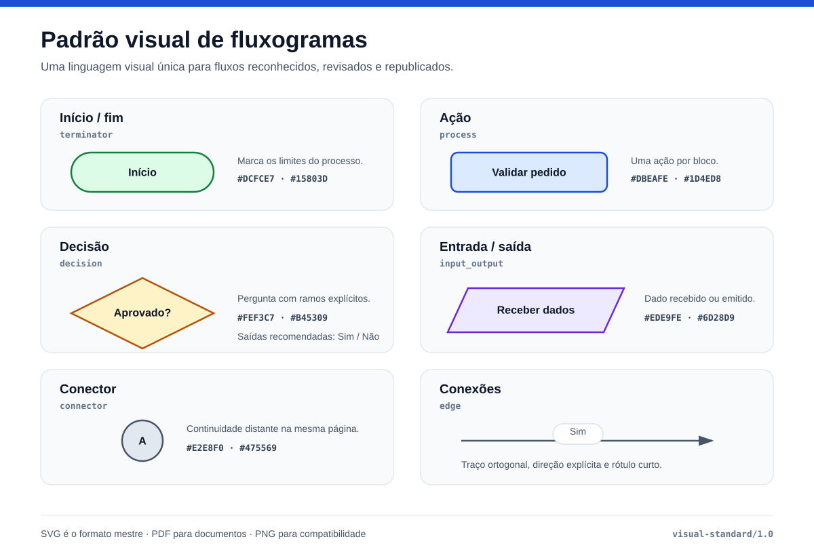

# Padrão visual de fluxogramas

Versão: **1.0**

## Objetivo

Toda equipe pode produzir o fluxograma na ferramenta e no estilo que preferir.
Depois do reconhecimento e da revisão do JSON, este projeto gera uma publicação
uniforme: mesmas formas, cores, tipografia, direção e regras de texto.

O JSON é a fonte semântica. O padrão visual pertence ao módulo de renderização e
não altera os dados reconhecidos.



Exemplo gerado a partir de JSON: [SVG](examples/rendered/standard-flow.svg) ·
[PNG](examples/rendered/standard-flow.png) ·
[JSON de origem](examples/standard-flow.json).

## Formato de entrega

| Formato | Uso recomendado |
|---|---|
| **SVG** | formato mestre; vetorial, leve, editável e com texto selecionável |
| **PDF** | documentos oficiais, impressão e arquivamento |
| **PNG** | sistemas legados, apresentações e canais que não aceitam vetor |

O SVG deve ser preservado mesmo quando também forem publicados PDF ou PNG. Assim,
uma mudança de tamanho ou identidade visual não exige nova inferência nem perde
qualidade.

## Símbolos

| Tipo JSON | Significado | Forma | Cor de apoio |
|---|---|---|---|
| `terminator` | início ou fim | cápsula/elipse | verde |
| `process` | ação executada | retângulo arredondado | azul |
| `decision` | pergunta que ramifica o fluxo | losango | âmbar |
| `input_output` | entrada ou saída de dados | paralelogramo | violeta |
| `connector` | continuidade em outro ponto da mesma página | círculo | cinza |
| `unknown` | símbolo não reconhecido que exige revisão | retângulo arredondado | cinza |

Forma e texto sempre comunicam o tipo. A cor é redundante para que o diagrama
continue compreensível em impressão monocromática ou por pessoas com deficiência
na percepção de cores.

Aliases antigos (`node`, `acao`, `decisao`, `inicio_fim`, `entrada_saida` e
`conector`) são normalizados pelo renderizador sem modificar o JSON original.
Tipos desconhecidos são normalizados como `unknown` e usam um retângulo cinza,
sinalizando que precisam de revisão. Continuidade entre páginas terá futuramente
um tipo próprio, `off_page_connector`; ela não deve ser confundida com o conector
circular da mesma página.

`arrow_head` é uma classe de reconhecimento, não um tipo de nó publicável. Ela é
usada para determinar a direção de uma aresta.

## Como escrever as ações

- **Processo:** começar com verbo no infinitivo e declarar uma ação por bloco:
  `Validar pedido`, `Cadastrar colaborador`, `Enviar proposta`.
- **Decisão:** escrever como pergunta que possa ser respondida pelos ramos:
  `Pedido aprovado?`, `Dados completos?`.
- **Início/fim:** preferir `Início` e `Fim`; quando necessário, qualificar o evento,
  como `Solicitação recebida`.
- **Entrada/saída:** indicar o dado ou resultado: `Receber nota fiscal`,
  `Emitir comprovante`.
- **Conector:** usar uma letra ou número curto e repetir o mesmo identificador no
  ponto de continuação.
- **Ramos:** usar rótulos breves e mutuamente exclusivos, normalmente `Sim` e
  `Não`.

Evite siglas locais, nomes de ferramentas quando a ação é independente delas e
frases com mais de uma ação. O renderizador quebra rótulos longos, mas a redação
curta melhora leitura e comparação entre equipes.

## Regras de layout

- direção padrão de cima para baixo (`TB`);
- fluxo principal no eixo central;
- entradas laterais somente quando representam dependência externa;
- espaçamento uniforme entre níveis e entre ramos;
- conectores ortogonais, com ponta de seta visível;
- cruzamentos devem ser evitados; use `connector` quando o fluxo precisar
  continuar longe do ponto atual;
- decisões devem ter rótulos nos ramos quando o significado não for evidente;
- texto em Arial 11 pt, cor escura e fundo claro para impressão.

## Gerar SVG, PDF e PNG de um JSON

Depois de instalar o projeto e o Graphviz:

```powershell
flowchart-render .\output\processo.json `
  --output-dir .\output\padronizado `
  --name processo-padronizado `
  --format svg `
  --format pdf `
  --format png `
  --rankdir TB `
  --page-size a4 `
  --orientation portrait `
  --dpi 300
```

Também é possível executar o módulo diretamente:

```powershell
.\.venv\Scripts\python.exe -m flowchart_converter.render_cli `
  .\output\processo.json `
  --output-dir .\output\padronizado `
  --format svg `
  --format pdf `
  --format png
```

O comando valida `schema_version`, referências de arestas e IDs antes de gerar os
arquivos. Isso permite corrigir manualmente textos e conexões no JSON e
renderizá-lo novamente sem executar YOLO ou OCR.

O perfil `content` mantém a página ajustada ao diagrama. O perfil `a4` limita a
publicação às dimensões de uma página A4. `--dpi` afeta somente a saída PNG.

## Contrato semântico 1.1

Para publicação, um nó precisa apenas de `id` e `type`; `text` pode ficar vazio.
Uma aresta precisa de `id`, `source` e `target`. `bbox`, `confidence`,
`ocr_confidence` e `source_type` são evidências opcionais do reconhecimento e não
controlam a posição do símbolo no diagrama reorganizado.

Os tipos canônicos são `terminator`, `process`, `decision`, `input_output`,
`connector` e `unknown`. O contrato formal está em
[`schemas/flowchart-1.1.schema.json`](../schemas/flowchart-1.1.schema.json).

## Tokens visuais da versão 1.0

| Elemento | Preenchimento | Contorno |
|---|---|---|
| início/fim | `#DCFCE7` | `#15803D` |
| processo | `#DBEAFE` | `#1D4ED8` |
| decisão | `#FEF3C7` | `#B45309` |
| entrada/saída | `#EDE9FE` | `#6D28D9` |
| conector | `#E2E8F0` | `#475569` |
| tipo desconhecido | `#F1F5F9` | `#64748B` |
| texto | — | `#0F172A` |
| aresta | — | `#475569` |

Mudanças futuras nesses tokens devem gerar uma nova versão da prancha, mas não
uma nova versão do schema JSON, pois não alteram a semântica do grafo.
